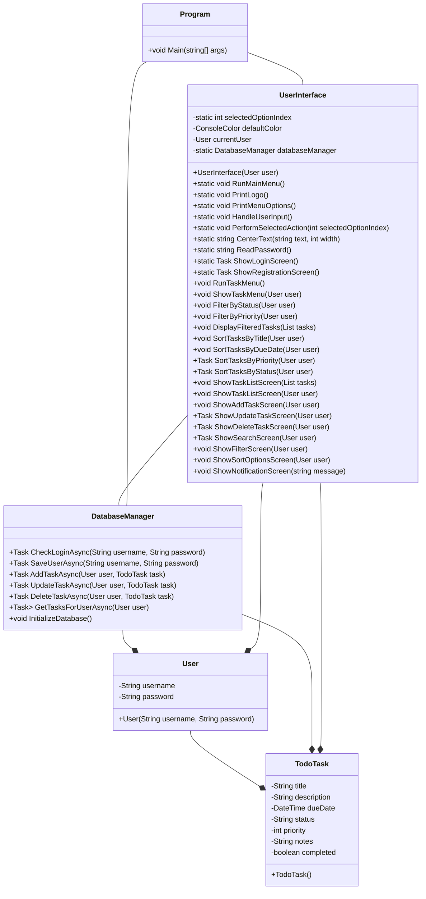

# TaskMaster

Dieses Diagramm veranschaulicht die Beziehungen zwischen den Klassen in der TaskMaster-Programm.:

```mermaid
classDiagram
    class User {
        -String username
        -String password
        +User(String username, String password)
    }
    class TodoTask {
        -String title
        -String description
        -DateTime dueDate
        -String status
        -int priority
        -String notes
        -boolean completed
        +TodoTask()
    }
    class DatabaseManager {
        +Task<bool> CheckLoginAsync(String username, String password)
        +Task SaveUserAsync(String username, String password)
        +Task AddTaskAsync(User user, TodoTask task)
        +Task UpdateTaskAsync(User user, TodoTask task)
        +Task DeleteTaskAsync(User user, TodoTask task)
        +Task<List<TodoTask>> GetTasksForUserAsync(User user)
        +void InitializeDatabase()
    }
    class UserInterface {
        -static int selectedOptionIndex
        -ConsoleColor defaultColor
        -User currentUser
        -static DatabaseManager databaseManager
        +UserInterface(User user)
        +static void RunMainMenu()
        +static void PrintLogo()
        +static void PrintMenuOptions()
        +static void HandleUserInput()
        +static void PerformSelectedAction(int selectedOptionIndex)
        +static string CenterText(string text, int width)
        +static string ReadPassword()
        +static Task ShowLoginScreen()
        +static Task ShowRegistrationScreen()
        +void RunTaskMenu()
        +void ShowTaskMenu(User user)
        +void FilterByStatus(User user)
        +void FilterByPriority(User user)
        +void DisplayFilteredTasks(List<TodoTask> tasks)
        +void SortTasksByTitle(User user)
        +void SortTasksByDueDate(User user)
        +Task SortTasksByPriority(User user)
        +Task SortTasksByStatus(User user)
        +void ShowTaskListScreen(List<TodoTask> tasks)
        +void ShowTaskListScreen(User user)
        +void ShowAddTaskScreen(User user)
        +Task ShowUpdateTaskScreen(User user)
        +Task ShowDeleteTaskScreen(User user)
        +Task ShowSearchScreen(User user)
        +void ShowFilterScreen(User user)
        +void ShowSortOptionsScreen(User user)
        +void ShowNotificationScreen(string message)
    }
    class Program {
        +void Main(string[] args)
    }
    User --* TodoTask
    DatabaseManager --* User
    DatabaseManager --* TodoTask
    UserInterface --* User
    UserInterface --* TodoTask
    UserInterface -- DatabaseManager
    Program -- DatabaseManager
    Program -- UserInterface
```
